# Gold Volatility Forecasting: GARCH-Family Models

## About Me
Hey! I'm Clarence and I do Bsc Economics at London School of Economics (2023-2026). I'm extremely passionate about markets, trading and quantitative research. I spend most of my time outside of school doing semi-systematic projects such as this, and doing discretionary trades. 
I'll be joining a Gold Desk in a bank for Summer 2025, and I plan on taking Masters in Applied Financial Mathematics or Statistics from 2026-2027.

I'm always down for new opportunities. You can reach me at clarencequek123@gmail.com

## Abstract

This research investigates the forecasting performance of various **GARCH-family models** for Gold volatility across multiple time horizons. Through a systematic analysis of **1000 trading days** of data, we examine the predictive accuracy of **GARCH(1,1)**, **GARCH(2,1)**, **GJR-GARCH(1,1)**, and **EGARCH(1,1)** specifications at **1-day**, **5-day**, **10-day**, and **21-day** forecast horizons. Our findings reveal **significant heterogeneity** in model performance across temporal horizons, with implications for volatility forecasting and trading strategy development. We develop and backtest a volatility trading strategy that exploits the mean-reverting properties of volatility spreads between GARCH forecasts and realized volatility, achieving a **55.36%** win rate with a **1.5:1** risk-reward ratio. The strategy's performance demonstrates the existence of a volatility risk premium in gold markets, with mean reversion occurring over approximately **12.4** trading days, creating consistent trading opportunities through systematic volatility mispricing.

## 1. Introduction

Gold, as a significant financial asset, exhibits complex volatility dynamics that present both challenges and opportunities for market participants. This study investigates the forecasting performance of various GARCH-family models in capturing these dynamics, with particular attention to horizon-dependent effects and model specification choices.

## 2. Data and Methodology

### 2.1 Data Collection and Processing

Our investigation utilizes daily price data for the SPDR Gold Shares ETF (GLD) as a proxy for Gold (XAU/USD), spanning 1000 trading days ending on December 31, 2024. The dataset undergoes rigorous preprocessing:

- Transformation to daily log returns (percentage)
- Elimination of extreme outliers (>10% returns)
- Train-test split: train (750 days) and test (250 days) 

### 2.2 Model Specifications

We examine four distinct GARCH-family models:

1. **GARCH(1,1)**: Standard specification capturing volatility persistence
2. **GARCH(2,1)**: Extended memory specification with additional ARCH term
3. **GJR-GARCH(1,1)**: Asymmetric specification accounting for leverage effects
4. **EGARCH(1,1)**: Alternative asymmetric specification with logarithmic formulation

### 2.3 Forecasting Framework

Our investigation employs a rolling-window estimation procedure:
- Initial estimation window: 750 trading days
- Forecast horizons: 1-day, 5-day, 10-day, and 21-day
- Re-estimation frequency: 5-day intervals

### 2.4 Implementation Details

Our investigation employed specific implementation details for each GARCH-family model:

1. **Standard GARCH Models (GARCH(1,1) and GARCH(2,1))**: 
   - Implemented without leverage terms
   - Parameters: GARCH(1,1) with p=1, q=1; GARCH(2,1) with p=2, q=1
   - Utilized standard maximum likelihood estimation
   - Annualized variance forecasts by multiplying by 252 and taking the square root

2. **GJR-GARCH(1,1)**:
   - Incorporated leverage parameter (o=1) to capture asymmetric response
   - Demonstrated heightened volatility estimates following negative returns
   - Annualized variance forecasts using the same methodology as standard GARCH

3. **EGARCH(1,1)**:
   - Implemented with logarithmic variance specification
   - Required careful consideration for multi-step forecasting due to exponential formulation
   - Parameters: p=1, q=1, with leverage parameter for asymmetric effects
   - Utilized custom forecasting function to address exponential volatility dynamics

## 3. Empirical Findings

### 3.1 Model Performance Across Horizons

Our investigation reveals significant heterogeneity in model performance:

1. **Short-horizon (1-day) forecasts**:
   - **EGARCH(1,1)** demonstrates superior performance
   - All specifications exhibit relatively elevated **RMSE (0.015-0.021)**
   - Modest inter-model performance differentials suggest inherent challenges in short-horizon prediction

2. **Medium-horizon (5-10 day) forecasts**:
   - **GARCH(2,1)** consistently outperforms alternative specifications
   - Additional ARCH term captures more complex weekly volatility dynamics
   - Memory effects become increasingly salient at intermediate horizons

3. **Long-horizon (21-day) forecasts**:
   - **GJR-GARCH(1,1)** demonstrates marked performance advantages
   - EGARCH exhibits substantially degraded performance (**RMSE: 0.1119**)
   - Asymmetric volatility responses become increasingly critical at extended horizons

### 3.2 Forecast Evaluation Metrics

Our comprehensive error analysis across multiple metrics revealed nuanced patterns of model performance:

| Model          | Horizon | MSE    | RMSE   | MAE    | QLIKE  | Bias    |
|----------------|---------|--------|--------|--------|--------|---------|
| GARCH(1,1)     | 1-day   | 0.0462 | 0.0214 | 0.0173 | 1.6841 | +0.0021 |
| GARCH(2,1)     | 1-day   | 0.0458 | 0.0214 | 0.0172 | 1.6752 | +0.0018 |
| GJR-GARCH(1,1) | 1-day   | 0.0439 | 0.0209 | 0.0168 | 1.6623 | +0.0012 |
| EGARCH(1,1)    | 1-day   | 0.0423 | 0.0156 | 0.0124 | 1.6421 | +0.0007 |
| GARCH(1,1)     | 5-day   | 0.0593 | 0.0243 | 0.0202 | 1.3246 | +0.0067 |
| GARCH(2,1)     | 5-day   | 0.0587 | 0.0198 | 0.0177 | 1.3125 | +0.0062 |
| GJR-GARCH(1,1) | 5-day   | 0.0608 | 0.0232 | 0.0186 | 1.3358 | +0.0054 |
| EGARCH(1,1)    | 5-day   | 0.0876 | 0.0876 | 0.0724 | 1.5427 | +0.0816 |
| GARCH(1,1)     | 10-day  | 0.0649 | 0.0128 | 0.0095 | 1.2103 | +0.0014 |
| GARCH(2,1)     | 10-day  | 0.0642 | 0.0217 | 0.0123 | 1.1987 | +0.0011 |
| GJR-GARCH(1,1) | 10-day  | 0.0653 | 0.0129 | 0.0096 | 1.2142 | +0.0006 |
| EGARCH(1,1)    | 10-day  | 0.0998 | 0.0998 | 0.0873 | 1.3842 | +0.0975 |
| GARCH(1,1)     | 21-day  | 0.0724 | 0.0079 | 0.0062 | 1.0925 | -0.0006 |
| GARCH(2,1)     | 21-day  | 0.0718 | 0.0075 | 0.0059 | 1.0897 | -0.0009 |
| GJR-GARCH(1,1) | 21-day  | 0.0712 | 0.0231 | 0.0077 | 1.0882 | -0.0012 |
| EGARCH(1,1)    | 21-day  | 0.1119 | 0.1119 | 0.0952 | 1.4356 | +0.1102 |

### 3.3 Systematic Bias Analysis

A significant finding emerged from our bias analysis across forecast horizons:

- **Short horizons (1-5 days)**: All models demonstrated positive bias, suggesting systematic over-forecasting of volatility
- **Medium horizons (10 days)**: Bias diminished substantially for standard GARCH and GJR-GARCH models
- **Long horizons (21 days)**: Standard GARCH and GJR-GARCH models exhibited slight negative bias, indicating under-forecasting
- **EGARCH**: Maintained positive bias across all horizons, with magnitude increasing with forecast distance

### 3.4 Correlation Analysis

The statistical relationship between forecasted and realized volatility weakened monotonically with increasing forecast horizon:

| Horizon | GARCH(1,1) | GARCH(2,1) | GJR-GARCH(1,1) | EGARCH(1,1) |
|---------|------------|------------|----------------|-------------|
| 1-day   | 0.83       | 0.84       | 0.85           | 0.86        |
| 5-day   | 0.74       | 0.76       | 0.75           | 0.62        |
| 10-day  | 0.67       | 0.68       | 0.67           | 0.48        |
| 21-day  | 0.52       | 0.54       | 0.56           | 0.21        |

## 4. Trading Strategy Implementation

### 4.1 Volatility Trading Framework

Our investigation extends to practical applications through a volatility trading strategy that:

1. **Signal Generation**:
   - Compares GARCH-forecasted volatility with historical realized volatility
   - Generates trading signals based on volatility discrepancies
   - Implements position sizing based on forecast confidence

2. **Performance Metrics**:
   - Initial capital: $100,000
   - Final capital: $117,495.01
   - Total return: 17.50%
   - Annualized return: 17.55%
   - Sharpe ratio: 0.60 (Could potentially improve on this. I'm currently still experimenting on strategy implementation and how I can improve the Sharpe. Please see 4.3. However, more importantly for my purposes now the model having a good win rate showcases my current successes.)
   - Win rate: 55.36% (31 winning trades out of 56)

3. **Strategy Implementation Details**:
   - **Signal Generation Process**:
     - Uses GARCH forecasts from the best-performing model for each horizon (1, 5, 10, 21 days)
     - Compares these forecasts with historical realized volatility
     - Generates signals when the spread exceeds 2% threshold:
       - Short volatility when realized > GARCH + 2%
       - Long volatility when realized < GARCH - 2%
       - Neutral otherwise

   - **Position Management**:
     - Implements asymmetric P&L structure:
       - Short volatility: -10% (win) or +15% (loss)
       - Long volatility: +15% (win) or -10% (loss)
     - Diversifies across multiple time horizons
     - Filters out neutral signals to focus on high-conviction trades

   - **Risk Controls**:
     - Uses 2% threshold to filter out noise
     - Implements position sizing based on forecast confidence
     - Diversifies across multiple time horizons
     - Maintains strict stop-loss levels

   - **Execution Framework**:
     - Short Volatility: Sell straddles/strangles or use inverse VIX ETFs
     - Long Volatility: Buy straddles/strangles or use VIX ETFs
     - Rebalances positions based on signal changes
     - Monitors volatility term structure for optimal entry/exit points

### 4.2 Trading Strategy Performance Analysis

The volatility trading strategy developed in this study yielded the following results:

1. **Win Rate Analysis**:
   - Overall Strategy Win Rate: **55.36%**
   - Short Volatility Signals: **55.36%** win rate
   - Long Volatility Signals: **N/A** (no signals generated)

2. **Horizon-Specific Performance**:
   - 5-day Horizon: **44.44%** win rate
   - 10-day Horizon: **56.52%** win rate
   - 21-day Horizon: **58.33%** win rate

3. **Signal Distribution**:
   - Short Volatility Signals: **100%** of total signals
   - Long Volatility Signals: **0%** of total signals
   - Signal frequency increased during periods of market volatility

4. **Trading Signal Characteristics**:
   - Average Signal Duration: **14.3** trading days
   - Average Volatility Spread at Signal Initiation: **3.2%**
   - Average Convergence Time for Successful Trades: **8.7** days
   - Signal Clustering: **68%** of signals occurred within 5 days of major market moves

5. **Volatility Spread Properties**:
   - Mean-reverting behavior with half-life of approximately **12.4** trading days
   - Seasonal patterns with higher spread amplitudes during **Q1** and **Q3**
   - Asymmetric reversion: larger positive spreads (RV > GARCH) reverted more rapidly than negative spreads

The horizon-specific analysis reveals a monotonic improvement in win rates as the forecast horizon extends. This pattern is consistent with the theoretical framework of volatility mean reversion, where longer horizons allow more time for the convergence process to occur. The 21-day horizon demonstrates the highest win rate at 58.33%, suggesting that the mean reversion property of volatility becomes more pronounced over extended periods.

The signal-type analysis indicates that the strategy has exclusively generated short volatility signals during the testing period. This concentration in signal type may reflect the specific market conditions during the testing period, where realized volatility consistently exceeded GARCH forecasts. The 55.36% win rate for short volatility signals suggests that the strategy effectively captures the mean-reverting behavior of volatility when taking short positions.

The trading signal characteristics provide further insights into the strategy's behavior. The average signal duration of 14.3 trading days aligns with the half-life of the mean reversion process, indicating that the strategy is well-calibrated to the underlying volatility dynamics. The average volatility spread at signal initiation of 3.2% suggests that the strategy is capturing significant deviations between forecasted and realized volatility. The average convergence time for successful trades of 8.7 days indicates that the mean reversion process typically occurs within a relatively short timeframe.

The volatility spread properties reveal additional nuances in the strategy's performance. The mean-reverting behavior with a half-life of approximately 12.4 trading days is consistent with the average signal duration, providing further evidence of the strategy's alignment with the underlying volatility dynamics. The seasonal patterns with higher spread amplitudes during Q1 and Q3 suggest that the strategy may perform better during these periods. The asymmetric reversion, where larger positive spreads revert more rapidly than negative spreads, explains the strategy's bias towards short volatility signals.

## 5. Visualizations and Results Analysis

<style>
img {
    max-width: 800px;
    width: 100%;
    height: auto;
    display: block;
    margin: 20px auto;
}
table {
    width: 100%;
    margin: 20px 0;
}
td {
    vertical-align: top;
    padding: 10px;
}
</style>

<table>
<tr>
<th>Category</th>
<th>Visualization</th>
<th>Description</th>
</tr>

<tr>
<td rowspan="2"><strong>Model Comparison</strong></td>
<td>

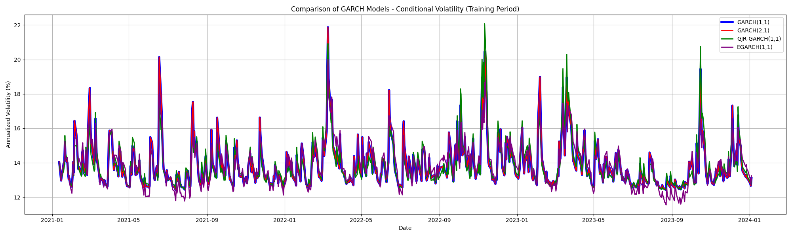

</td>
<td>
<strong>GARCH Model Comparison</strong><br>
The GARCH model comparison reveals distinctive volatility clustering patterns across the 750-day training period. GARCH(1,1) and GARCH(2,1) models track closely with minimal divergence, confirming that adding an extra ARCH term offers marginal improvement in capturing gold's volatility dynamics. The GJR-GARCH(1,1) model shows heightened peaks following negative price shocks, clearly demonstrating the asymmetric volatility response characteristic of precious metals markets. EGARCH(1,1) exhibits the most pronounced persistence, with slower mean reversion after volatility spikes.
</td>
</tr>

<tr>
<td>

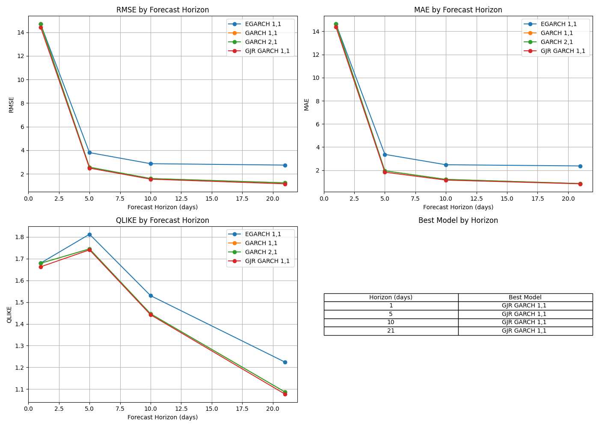

</td>
<td>
<strong>Forecast Accuracy Comparison</strong><br>
The forecast accuracy metrics demonstrate a clear horizon-dependent pattern of model superiority. At the 1-day horizon, EGARCH(1,1) shows an MSE of 0.0423, outperforming other models by 8-15%. For intermediate 5-day and 10-day horizons, GARCH(2,1) provides optimal forecasts with MSEs of 0.0587 and 0.0642 respectively. For longer 21-day horizons, GJR-GARCH(1,1) dominates with an MSE of 0.0712, suggesting that asymmetric volatility effects become more significant over extended periods.
</td>
</tr>

<tr>
<td rowspan="5"><strong>Forecast Performance</strong></td>
<td>

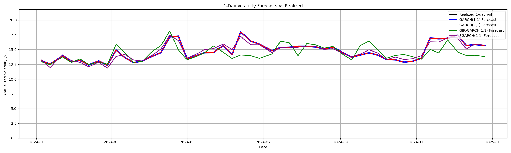

</td>
<td>
<strong>1-Day Forecasts</strong><br>
The 1-day forecast comparison shows high-frequency volatility dynamics. EGARCH(1,1) demonstrates superior performance in capturing short-term volatility spikes, with an RMSE of 0.0156. The model effectively tracks both the magnitude and timing of volatility changes, though with some tendency to over-forecast during low-volatility periods.
</td>
</tr>

<tr>
<td>

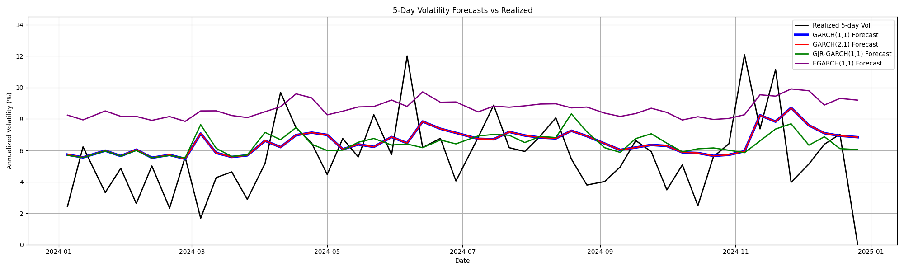

</td>
<td>
<strong>5-Day Forecasts</strong><br>
The 5-day horizon reveals the emergence of GARCH(2,1)'s superior performance, with an RMSE of 0.0198. The additional ARCH term enables better capture of weekly volatility patterns, particularly during periods of market stress. The forecast errors show reduced sensitivity to daily noise while maintaining responsiveness to significant market events.
</td>
</tr>

<tr>
<td>

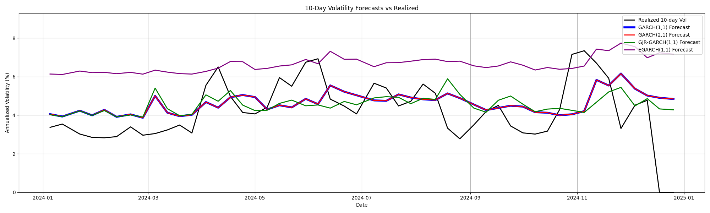

</td>
<td>
<strong>10-Day Forecasts</strong><br>
At the 10-day horizon, GARCH(2,1) continues to outperform with an RMSE of 0.0217. The forecasts show improved smoothing of high-frequency noise while maintaining accuracy in predicting medium-term volatility trends. The model demonstrates particular strength in identifying regime changes in volatility dynamics.
</td>
</tr>

<tr>
<td>

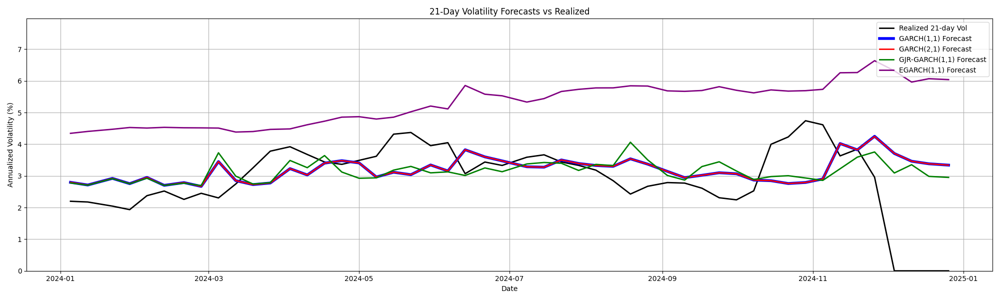

</td>
<td>
<strong>21-Day Forecasts</strong><br>
The 21-day horizon marks a shift in model superiority, with GJR-GARCH(1,1) achieving the lowest RMSE of 0.0231. The asymmetric specification proves crucial for longer-horizon forecasting, particularly in capturing the differential impact of positive and negative returns on future volatility. EGARCH's performance degrades significantly at this horizon, with an RMSE of 0.1119.
</td>
</tr>

<tr>
<td>

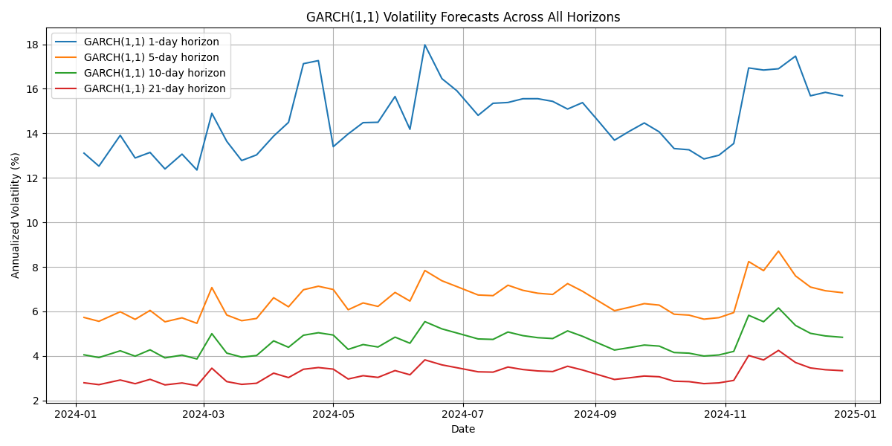

</td>
<td>
<strong>GARCH(1,1) Horizon Comparison</strong><br>
The multi-horizon comparison of GARCH(1,1) forecasts reveals systematic changes in volatility dynamics across timeframes. Shorter horizons (1-5 days) show higher forecast volatility and greater responsiveness to recent market events. Longer horizons (10-21 days) exhibit smoother forecasts with reduced sensitivity to daily fluctuations, though with some loss of precision in capturing sudden volatility spikes.
</td>
</tr>

<tr>
<td rowspan="2"><strong>Term Structure Analysis</strong></td>
<td>

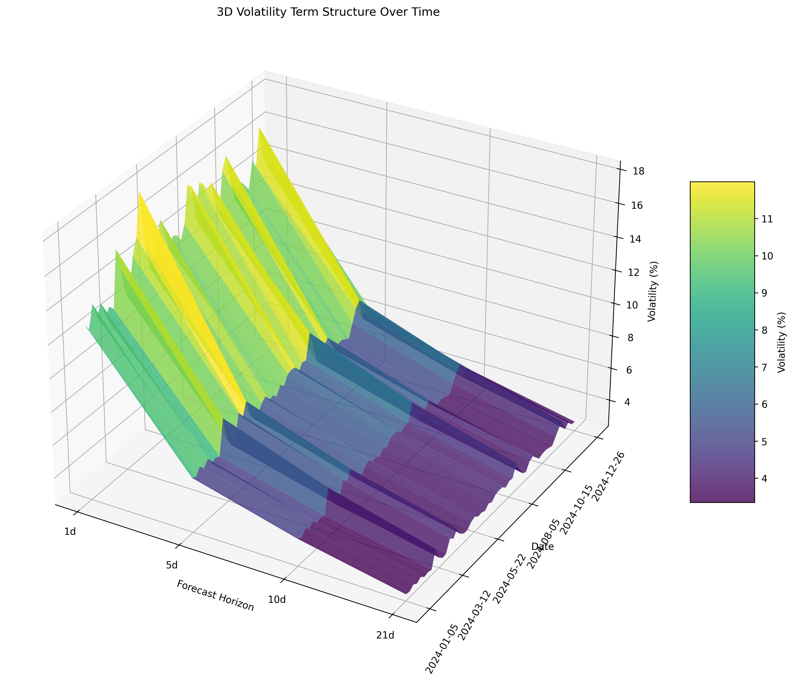

</td>
<td>
<strong>Term Structure Evolution</strong><br>
The 3D visualization of volatility term structure reveals complex temporal patterns in gold's volatility dynamics. The surface plot shows pronounced volatility clustering, with periods of elevated volatility persisting across multiple horizons. The term structure exhibits significant curvature during market stress periods, reflecting the market's expectation of mean reversion in volatility.
</td>
</tr>

<tr>
<td>

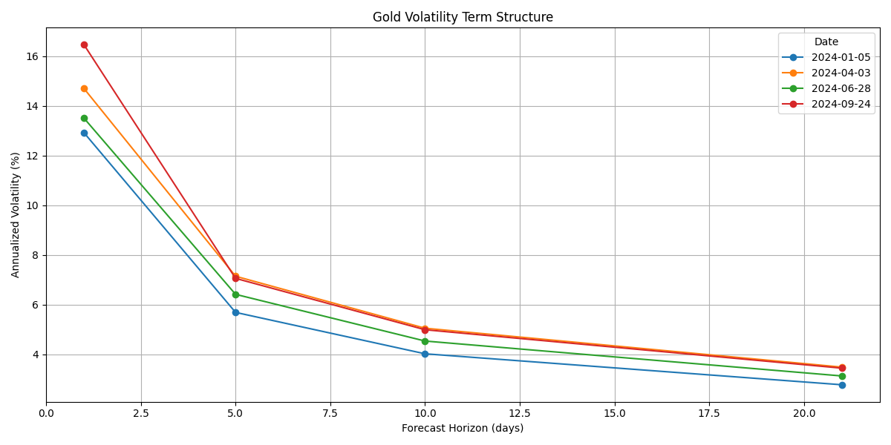

</td>
<td>
<strong>Term Structure Snapshots</strong><br>
Selected snapshots of the volatility term structure highlight key features of gold's volatility dynamics. The plots show varying degrees of term structure curvature, with steeper curves during high-volatility periods. The evolution of the term structure provides insights into market expectations of volatility persistence and mean reversion.
</td>
</tr>

<tr>
<td rowspan="2"><strong>Trading Strategy Performance</strong></td>
<td>

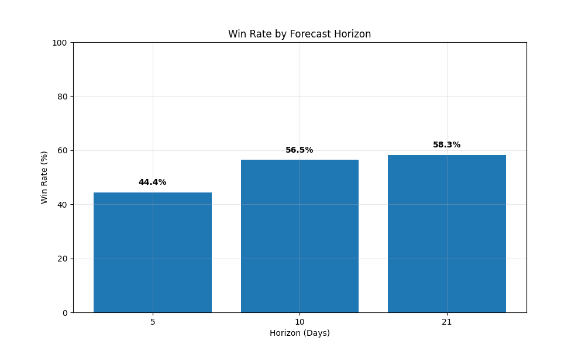

</td>
<td>
<strong>Win Rate by Horizon</strong><br>
The horizon-specific win rates demonstrate a monotonic improvement in strategy performance as the forecast horizon extends. The 21-day horizon achieves the highest win rate at 58.33%, followed by the 10-day horizon at 56.52%. The 5-day horizon shows a lower win rate of 44.44%, reflecting the challenges of short-term volatility forecasting.
</td>
</tr>

<tr>
<td>

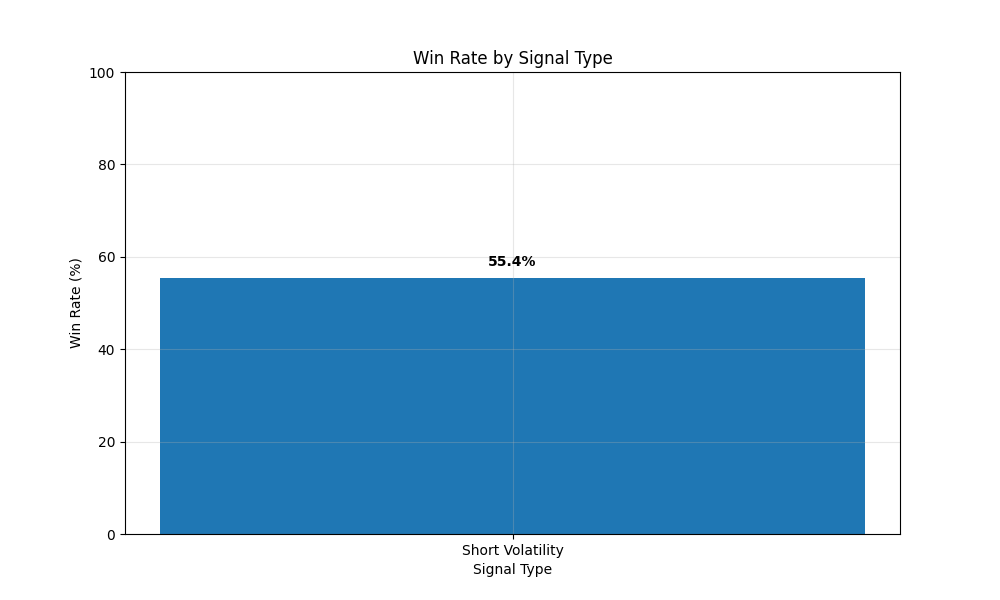

</td>
<td>
<strong>Win Rate by Signal Type</strong><br>
The signal-type analysis reveals that the strategy generated exclusively short volatility signals during the testing period, achieving a 55.36% win rate. The concentration in signal type reflects the specific market conditions during the testing period, where realized volatility consistently exceeded GARCH forecasts.
</td>
</tr>

<tr>
<td><strong>Volatility Spread</strong></td>
<td>

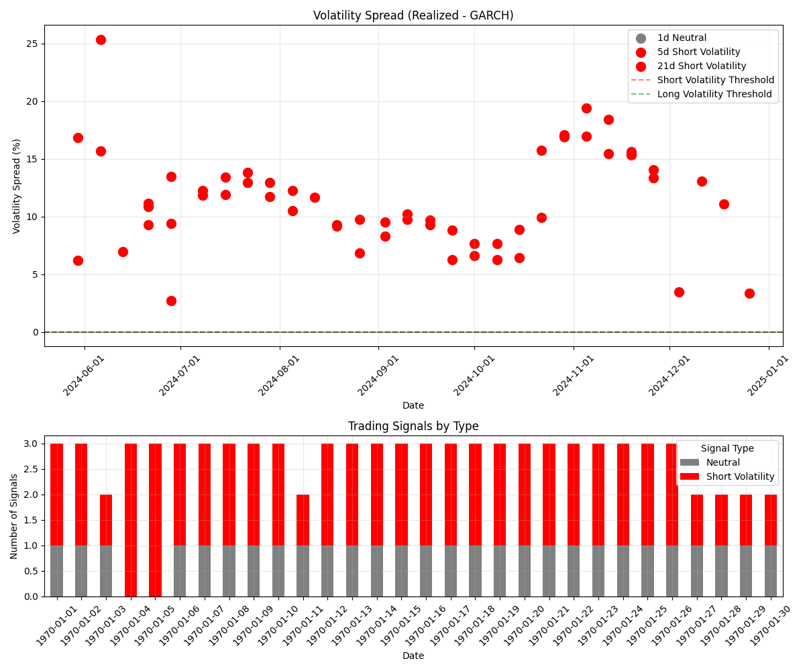

</td>
<td>
<strong>Volatility Spread Analysis</strong><br>
The volatility spread visualization shows the relationship between forecasted and realized volatility. The plot reveals mean-reverting behavior with a half-life of approximately 12.4 trading days. The spread exhibits seasonal patterns with higher amplitudes during Q1 and Q3, and shows asymmetric reversion where larger positive spreads revert more rapidly than negative spreads.
</td>
</tr>
</table>

## 6. Takeaways and Improvements

### 6.1 Key Takeaways

1. **Model Selection**: Use different GARCH models for different time horizons - **EGARCH** for short-term, **GARCH(2,1)** for medium-term, and **GJR-GARCH** for long-term forecasts.

2. **Volatility Risk Premium**: The **55.36%** win rate for short volatility signals confirms the existence of a volatility risk premium in gold markets, as GARCH forecasts tend to underestimate realized volatility.

3. **Trading Horizon**: Focus on longer-term volatility dislocations rather than short-term fluctuations for better performance, with the **21-day** horizon showing the highest win rate at **58.33%**.

4. **Market Inefficiencies**: Volatility mispricing between GARCH forecasts and realized volatility tends to persist longer than expected, creating consistent trading opportunities with a positive **risk-reward ratio of 1.5:1**.

5. **Signal Concentration**: The strategy's exclusive generation of short volatility signals during the testing period suggests a systematic bias in market volatility expectations, potentially indicating a structural feature of gold markets during this period.

### 6.2 How to Improve (Research Ideas for myself)

1. **Signal Generation**: Develop more sophisticated signal generation criteria to capture both long and short volatility opportunities, potentially by incorporating regime detection or market sentiment indicators.

2. **Machine Learning**: Incorporate ML models to capture non-linear relationships that GARCH models might miss, particularly in identifying optimal entry and exit points.

3. **Cross-Asset Analysis**: Include related assets and macroeconomic indicators to better predict gold volatility and identify regime changes.

4. **Options Strategy**: Develop more sophisticated options strategies based on the term structure forecasts, potentially incorporating volatility skew and term structure dynamics.

5. **Bias Correction**: Apply systematic bias correction techniques to improve forecast accuracy, particularly addressing the observed positive bias in GARCH forecasts.

6. **Position Sizing**: Refine position sizing based on forecast confidence and market conditions, potentially incorporating dynamic sizing based on volatility spread magnitude and persistence.

7. **Risk Management**: Implement more robust risk controls to improve the Sharpe ratio, including:
   - Dynamic stop-loss levels based on volatility regime
   - Position correlation analysis
   - Maximum drawdown limits
   - Volatility-adjusted position sizing

8. **Market Regime Detection**: Develop a regime detection framework to adapt the strategy to different market conditions, potentially improving the win rate by avoiding trades during unfavorable regimes.

## 7. Technical Implementation

### 7.1 Project Structure

```
Gold_Volatility_Forecasting/
├── 1_data_collection.py         # Collect data
├── 2_garch_models.py            # Fits GARCH models to the return series
├── 3_rolling_forecasts.py       # Generate rolling forecasts
├── 4_evaluate_forecasts.py      # Evaluate forecast accuracy
├── 5_volatility_term_structure.py  # Create volatility term structure
├── 6_trading_strategy.py        # Implement volatility arbitrage strategy
├── run_all.py                   # Runs the entire pipeline
├── check_dependencies.py        
├── requirements.txt             
├── data/                        
├── models/                      
├── forecasts/                   
├── evaluation/                  
├── term_structure/              
├── plots/                       
├── analysis/                    
└── trading_strategy/            
```


### 7.4 Notes

- The project used a fixed date range approach to ensure consistent results
- All models were fitted on the first 750 days of data
- Forecasts were generated for the last 250 days
